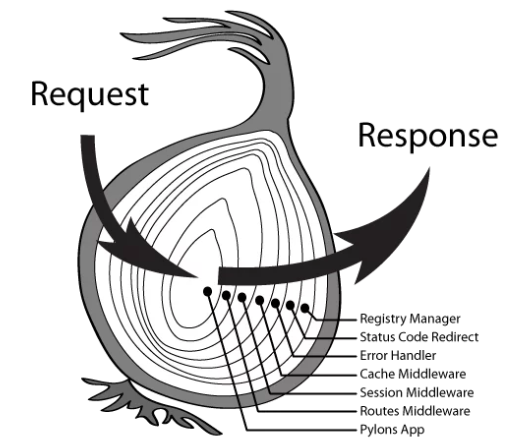
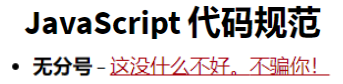

*本文为基于Koa实现的静态文件访问和API功能网站的实验文档*

> Github: <https://github.com/WenWeiTHU/koa-website>

## 服务器（已于2019.8.1关闭）

> IP: 152.136.227.192

> 端口: 8000
>
> Token: ELSKBLXKYVPXQWLTMIPCJEFPFP

## 框架选择

本次实验选择了 Koa 作为 Node 后端框架， 一是它的灵活度比较高， 二是它有不少较为完善的库可以使用。 通过后端平台的搭建， 我对异步函数的执行过程， Koa 中间件的使用， Koa的洋葱模型有了深入的认识。

## 静态文件服务

此次作业要求将之前的个人主页搭载到服务器后端上， 使用 koa-static 包就可以了。 它的原理是根据端口请求映射到服务器文件夹的文件路径。这里有一点要注意： staticRouter 会优先响应网站的 router 请求， 如果在代码的其他部分使用了 router， staticRouter 会拦截此请求， 就会导致 api 访问失败， 所以 staticRouter 中间件应该放在最后。

## API 服务

实现简单计算和数据库访问， 首先要搞明白 ctx 对象的属性， 参数 ctx 是由 koa 传入的封装了 request和 response的变量，我们可以通过它访问 request和 response。再通过 router 对 api 访问进行路由，用不同的函数处理 request 并设置 response。一开始我使用 koa-bodyparser 解析 request 发现 query 为空的现象， 最后 Google发现其不能解析 multipart/form-data 类型。 最后使用 koa-body 来解析， 发现可以 完美解决此问题。 代码中用一个本地数组存储键值对， 并进行相应增删改查。 细节上要注意 token 的先决判断， Content-type 和状态码的设置， 运算结果向下取整和使用 Number()不使用 parserInt()的细节(如 firstParam = 0011)。

## 代码风格

之前一直是用 vscode 的 Beautify File 插件格式化代码， 然后用 eslint 一跑， 发现超多 error， 仔仔细细看了一遍规范， 不得不说， 真是挺严格的！ 包括不让用分 号和两个空格缩进， 最后优化完， 的确挺好看的。 之前一直觉得 JavaScript 就像python 和 C++的融合， 现在看了 eslint 标准的代码风格， 可能 JavaScript 也想走 一条属于自己的路吧。 这也让我注意到一以前没有怎么关注的代码风格， 毕竟程序员们不总是一个人孤军奋战， 好的代码风格可能让团队里其他人更理解你。

## 总结

通过这次 NodeJS 服务开发的实践。 我对 NodeJS 的使用和 JavaScript 的异步特性有了更深的认识。 在 JavaScript 的世界中，所有代码都是单线程执行的， 由于这个“缺陷”，导致 JavaScript 的所有网络操作，浏览器事件，都必须是异步执行。异步执行可以用回调函数实现， 也可以通过 E6 的新特性 async， koa 框架支持 async 和 await 特性， 是一个非常好的入门框架。 除了这些东西之外， 我还了解了网站的工作原理和代码风格的重要性， 最重要的是对 http2 协议有了系统的了解。 前端实验真的能让人学到很多。

