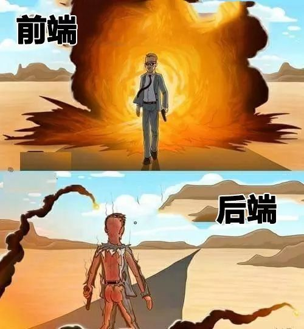
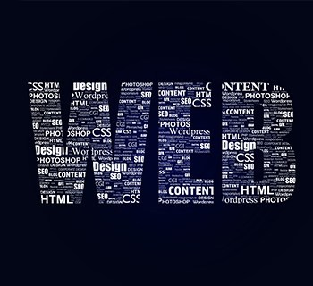

## 对Web前端的理解
有一张非常经典的图解释了前端和后台的关系，虽然是调侃，但一个酷炫的前端的确能在第一时间给客户一个良好的印象，网站没有前端效果的支撑，不管后端功能实现如何完善，都不能赢得客户的青睐，甚至是沦为残次品，在竞争激烈的互联网世界，我们越来越偏向于沦为视觉动物，前端效果是一个web网站美感和基本用户体验的灵魂的展现，更是企业实力的呈现。对于网站优化来说，最重要的是网站用户体验度，网站前端设计直接决定了用户体验度的高低。用户体验度是客户的一种纯主观的感受，如何给客户良好的主观感受，就得站在客户的角度考虑问题，阅览内容主题重点突出，视觉效果好，交互趣味性，有效性，增加阅览的愉悦性观赏性，以此达到留住用户的目的，这些都是需要前端效果实现去呈现的。

## 课程期待
之前上过一些网页设计的基础课程,是使用旧版Adobe Dreamweaver工具制作,有些类似Word的“所见即所得”的设计方法，尽管制作起来很方便，但有一个很大的问题就是兼容性差，在本地制作的网页或许视觉效果不错，可一旦移植到网站或者使用另外的浏览器就会出现排版错位和样式错误。相比之下，基于代码的html页面设计更费时，但是具有很好的可移植性。就像这次实验，我花了大量的时间进行各种浏览器的兼容调试，很重要的几点如使用相对定位和百分比尺寸，还有一些尺寸单位的妙用，只有做好了这些才是一个美观的网页的应具备的基本要求。除此之外，现在有许多开源的框架（如Vue, NodeJs, React）和现成的样式库，使得开发人员可以把重心放在网页设计与组合上，从这些框架内部的样式设计也可以学到很多东西。所以我对这次学习Html+Css+Javascript网页制作的期待就是，首先通过这一次作业，基于完全手写的Html代码深入理解网页应该如何设计与组织，以及如何利用Css和Javascript美化网页，之后从一些常用模板(如Markdown+Jekyll， Markdown+Hexo）,学习专业网页设计的思路，也发挥自己的创造力，维护一个漂亮的个人日志界面。

## 结语
最后,希望自己在这个暑假学有所得,关于网页设计的知识多而复杂,所以只有将学习和实战结合才会有所收获,希望老师和助教可以分享一些更高层面的前端设计理念,让我们一边学习,一边实战,利用学到的知识,不断完善自己的网页,并通过这个主页记录自己的成长!